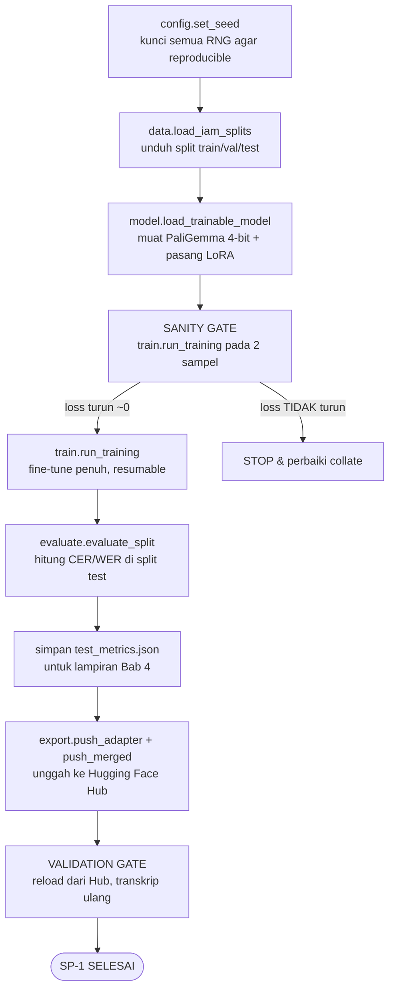
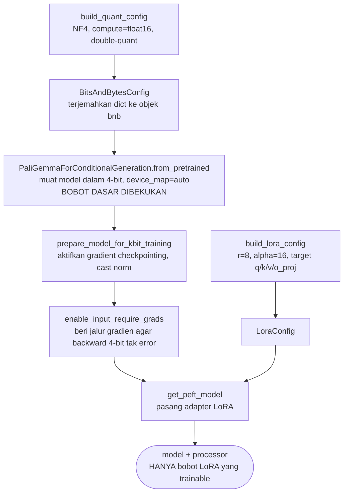

# SP-1 — Dokumen Alur & Algoritma (Fungsi-ke-Fungsi)

Dokumen ini menjelaskan **alur kerja SP-1** (fine-tuning PaliGemma-3B dengan QLoRA pada
dataset IAM-line) secara berurutan, **dari satu fungsi ke fungsi berikutnya**. Tujuannya
agar setiap langkah pipeline bisa dijelaskan dengan jelas pada penulisan skripsi (Bab
Metodologi & Implementasi).

- **Model dasar:** `google/paligemma-3b-pt-448` (input gambar 448×448)
- **Dataset:** `Teklia/IAM-line` (split resmi: train / validation / test)
- **Metode:** QLoRA — model dasar dibekukan dalam 4-bit (NF4), hanya adapter LoRA kecil yang dilatih
- **Keluaran akhir:** angka CER/WER (baseline M1) + bobot adapter & model gabungan (merged) di Hugging Face Hub

> **Catatan peran modul:** `notebooks/sp1_train.ipynb` hanya **lem tipis** (orkestrasi).
> Seluruh logika sebenarnya ada di package teruji `src/htr_sp1/`. Notebook memanggil
> fungsi-fungsi di bawah ini secara berurutan.

---

## 1. Peta Modul (Siapa Memanggil Siapa)

```
config.py      ← sumber tunggal semua angka/path/identifier (dipakai SEMUA modul)
   │
data.py        → load_iam_splits(), build_prompt(), build_training_example()
model.py       → build_quant_config(), build_lora_config(), load_trainable_model()
train.py       → build_training_args(), find_resume_checkpoint(), run_training()
                    └── memanggil data.build_training_example() di dalam collate()
inference.py   → generate_transcription()          (kontrak yang dikonsumsi SP-2)
metrics.py     → cer(), wer()                       (pembungkus pustaka jiwer)
evaluate.py    → evaluate_split()
                    ├── memanggil inference.generate_transcription() (via callable)
                    └── memanggil metrics.cer() & metrics.wer()
export.py      → adapter_repo_id(), merged_repo_id(), push_adapter(), push_merged()
```

**Prinsip desain:** fungsi "ringan" (mengembalikan dict konfigurasi) dipisah dari fungsi
"berat" (yang benar-benar memuat model di GPU). Ini membuat sebagian besar logika bisa diuji
di laptop tanpa GPU/unduhan, sementara bagian berat hanya jalan saat training.

---

## 2. Diagram Alur Eksekusi



---

## 3. Algoritma Langkah-demi-Langkah (dengan fungsi yang dipanggil)

### Langkah 0 — Persiapan & Reproducibility
**Fungsi:** `config.set_seed()`

Mengunci semua sumber acak (Python `random`, NumPy, PyTorch, CUDA) ke nilai `SEED = 42`.
Tujuannya: hasil training bisa diulang dan dipertanggungjawabkan secara ilmiah.

```python
config.set_seed()   # → seed = 42
```

---

### Langkah 1 — Muat Dataset IAM-line
**Fungsi:** `data.load_iam_splits()`

Mengunduh dataset `Teklia/IAM-line` dari Hugging Face Hub, mengembalikan `DatasetDict`
berisi tiga split. Tiap record punya field `image` (PIL.Image satu baris tulisan tangan) dan
`text` (transkripsi ground-truth).

```python
ds = data.load_iam_splits()
# ds["train"], ds["validation"], ds["test"]
```

**Mengapa lazy import:** modul `datasets` diimpor di dalam fungsi, supaya modul `data.py`
tetap ringan saat unit test di laptop (tidak memicu unduhan).

---

### Langkah 2 — Bangun Model yang Bisa Dilatih (QLoRA)
**Fungsi utama:** `model.load_trainable_model()`
**Fungsi pendukung:** `model.build_quant_config()`, `model.build_lora_config()`

Urutan internal di dalam `load_trainable_model()`:

1. `build_quant_config()` → menghasilkan deskripsi 4-bit **NF4** (`bnb_4bit_compute_dtype =
   float16` karena T4 hanya mendukung fp16, double-quant aktif untuk hemat memori).
2. Memuat `PaliGemmaForConditionalGeneration` dalam 4-bit (`device_map="auto"` membiarkan
   accelerate menempatkan layer di GPU tunggal). Model dasar ini **dibekukan**.
3. `prepare_model_for_kbit_training()` → menyiapkan model 4-bit untuk dilatih (mengaktifkan
   gradient checkpointing, dsb.).
4. `enable_input_require_grads()` → memastikan jalur gradien ada saat gradient checkpointing
   dipakai pada model 4-bit (tanpa ini backward pass error).
5. `build_lora_config()` → bentuk adapter LoRA (`r=8`, `alpha=16`, hanya modul atensi
   `q/k/v/o_proj` pada decoder bahasa — vision tower & projector TIDAK diadaptasi di baseline).
6. `get_peft_model()` → membungkus model dengan adapter; **hanya bobot LoRA kecil yang akan
   dilatih.**

```python
model, processor = model.load_trainable_model()
model.print_trainable_parameters()   # konfirmasi hanya adapter kecil yang trainable
```

**Keluaran:** `(model, processor)`. `model` = PaliGemma 4-bit + adapter LoRA; `processor` =
`PaliGemmaProcessor` yang cocok (untuk encode gambar+teks).

#### Diagram detail: perakitan QLoRA di dalam `load_trainable_model()`



**Inti QLoRA yang terbaca dari diagram:** model dasar 3B dimuat dalam 4-bit lalu **dibekukan**
(langkah L2). Yang dilatih hanya adapter LoRA kecil yang dipasang di akhir (L6). Langkah L3–L4
adalah "jembatan teknis" wajib agar pelatihan adapter di atas model 4-bit + gradient
checkpointing tidak error pada backward pass. Dua jalur (`build_quant_config` dan
`build_lora_config`) berjalan paralel lalu bertemu di `get_peft_model`.

---

### Langkah 3 — Sanity Gate (Overfit 2 Sampel)
**Fungsi:** `train.run_training(model, processor, tiny, tiny, output_dir)` dengan `tiny =
ds["train"].select(range(2))`

Melatih pada **2 sampel saja** selama beberapa langkah. **Loss harus turun ke ~0.** Jika
tidak, berhenti dan perbaiki — jangan buang jam-jam GPU pada run penuh.

Ini adalah titik integrasi paling rawan: fungsi `collate()` (lihat Langkah 4) yang
menyatukan gambar+prompt+label. Gate ini sengaja ada untuk memunculkan error bentuk tensor
sedini mungkin.

```python
tiny = ds["train"].select(range(2))
train.run_training(model, processor, tiny, tiny, output_dir="/workspace/sanity_check")
```

---

### Langkah 4 — Fine-Tuning Penuh
**Fungsi utama:** `train.run_training(model, processor, ds["train"], ds["validation"], output_dir)`
**Fungsi pendukung:** `train.build_training_args()`, `train.find_resume_checkpoint()`,
`data.build_training_example()`, `data.build_prompt()`

Urutan internal di dalam `run_training()`:

1. `build_training_args(output_dir)` → menghasilkan field `TrainingArguments`:
   - `per_device_train_batch_size=1`, `gradient_accumulation_steps=8` → **effective batch = 8**
   - `num_train_epochs=3`, `learning_rate=2e-4`
   - `gradient_checkpointing=True`, `fp16=True` (tukar memori demi muat di 16GB)
   - `save_strategy="epoch"` & `evaluation_strategy="epoch"` → checkpoint + eval tiap epoch
2. Mendefinisikan `collate(batch)` — untuk setiap record memanggil
   `data.build_training_example(record, processor)`:
   - `build_training_example()` memanggil `build_prompt()` (prompt `"transcribe the
     handwritten text\n"`) lalu `processor(text=prompt, images=image, suffix=text)`.
   - `suffix=text` membuat processor otomatis menyusun **label** (token prompt di-mask dari
     loss; hanya token jawaban yang dihitung). Inilah inti supervised fine-tuning.
   - Hasil tiap record di-pad menjadi batch tensor oleh `processor.tokenizer.pad(...)`.
3. `find_resume_checkpoint(output_dir)` → mencari folder `checkpoint-<step>` terbaru. Jika
   ada (mis. sesi sebelumnya terputus), training **dilanjutkan**, bukan diulang dari nol.
4. `Trainer.train(resume_from_checkpoint=...)` → loop pelatihan sebenarnya berjalan.

```python
model = train.run_training(model, processor, ds["train"], ds["validation"],
                           output_dir=OUTPUT_DIR)
```

**Catatan eval:** `Trainer` mengukur **eval LOSS** tiap epoch (bukan generate). CER/WER
sebenarnya dihitung terpisah di Langkah 5.

---

### Langkah 5 — Evaluasi pada Split Test (Angka Baseline M1)
**Fungsi utama:** `evaluate.evaluate_split(records, transcribe)`
**Fungsi pendukung:** `inference.generate_transcription()`, `metrics.cer()`, `metrics.wer()`

`evaluate_split()` menerima sebuah callable `transcribe`. Di notebook, callable ini
mengikat model+processor yang **sudah dimuat**:

```python
transcribe = lambda img: inference.generate_transcription(model, processor, img)
report = evaluate.evaluate_split(ds["test"], transcribe)
```

Urutan internal:

1. Untuk setiap record test, panggil `transcribe(record["image"])`:
   - Di dalam `inference.generate_transcription()`: encode gambar+prompt **tanpa suffix**
     (saat inferensi tidak ada ground-truth), catat panjang prompt, lakukan **greedy decode**
     (`model.generate`), lalu **buang token prompt** dan sisakan hanya jawaban model →
     `processor.decode(...).strip()`.
   - Pemotongan prompt ini penting: jika prompt ikut terbawa, CER/WER jadi rusak.
2. Hitung error per-sampel: `metrics.cer(gt, pred)` dan `metrics.wer(gt, pred)` (keduanya
   berbasis jarak edit Levenshtein via `jiwer`, dikali 100 → persen).
3. Kembalikan dict: `mean_cer`, `mean_wer`, `num_samples`, dan `per_sample` (daftar baris
   untuk tabel lampiran Bab 4).

```python
report["mean_cer"], report["mean_wer"]   # angka baseline M1 untuk skripsi
```

---

### Langkah 6 — Simpan Metrik untuk Lampiran Skripsi
Menulis `report` ke `test_metrics.json` (per-sampel + ringkasan) untuk tabel di Bab 4.
Tidak ada fungsi khusus — hanya `json.dump(report, ...)` di notebook.

---

### Langkah 7 — Ekspor ke Hugging Face Hub
**Fungsi:** `export.push_adapter()`, `export.push_merged()`,
`export.adapter_repo_id()`, `export.merged_repo_id()`

Dua artefak diunggah (deliverable untuk SP-2):

1. `push_adapter(model, processor, adapter_repo_id(base))` → mengunggah **adapter LoRA**
   (kecil; perlu dipasangkan dengan model dasar saat load) + processor. Repo privat.
2. `push_merged(model, processor, merged_repo_id(base))` → memanggil `model.merge_and_unload()`
   untuk **melebur adapter ke bobot dasar**, menghasilkan model fp16 mandiri, lalu mengunggah.
   Model merged ini praktis untuk runtime SP-2 dan konversi GGUF/MLX di masa depan.

```python
export.push_adapter(model, processor, export.adapter_repo_id(base))
export.push_merged(model, processor, export.merged_repo_id(base))
```

---

### Langkah 8 — Validation Gate (Reload dari Hub)
Memuat ulang model **merged** dari Hub **tanpa state lokal**, lalu mentranskrip beberapa
gambar test menggunakan `inference.generate_transcription()`. Jika hasilnya masuk akal,
**Definition of Done SP-1 tercapai**: model benar-benar tersimpan dengan benar dan bisa
dipakai SP-2.

```python
v_model = PaliGemmaForConditionalGeneration.from_pretrained(merged_repo_id, device_map="auto")
v_proc  = PaliGemmaProcessor.from_pretrained(merged_repo_id)
inference.generate_transcription(v_model, v_proc, img)   # kontrak yang sama dipakai SP-2
```

---

## 4. Ringkasan Kontrak Antar Sub-Project

Fungsi `inference.generate_transcription(model, processor, image, prompt=...)` adalah
**kontrak yang dikonsumsi SP-2**:

- **M1 (Baseline)** = panggilan ini dengan prompt transkripsi default.
- **M2 (CoT)** = model yang sama, hanya **prompt-nya diganti** (SP-2 yang menukar prompt
  lewat parameter `prompt`).

Inilah alasan fungsi ini dibuat tipis & stabil: satu fungsi melayani dua skenario.

---

## 5. Hiperparameter Kunci (semua di `config.py`)

| Parameter | Nilai | Fungsi |
|---|---|---|
| `BASE_MODEL_ID` | `google/paligemma-3b-pt-448` | model dasar |
| `DATASET_ID` | `Teklia/IAM-line` | dataset |
| `PER_DEVICE_TRAIN_BATCH_SIZE` | 1 | hemat memori |
| `GRAD_ACCUMULATION_STEPS` | 8 | effective batch = 8 |
| `LEARNING_RATE` | 2e-4 | khas adapter LoRA |
| `NUM_TRAIN_EPOCHS` | 3 | jumlah epoch |
| `MAX_TARGET_TOKENS` | 64 | batas panjang generate (baris IAM pendek) |
| `LORA_R` / `LORA_ALPHA` / `LORA_DROPOUT` | 8 / 16 / 0.05 | bentuk adapter |
| `LORA_TARGET_MODULES` | `q/k/v/o_proj` | modul yang diadaptasi |
| `SEED` | 42 | reproducibility |

> Mengubah eksperimen = mengubah satu nilai di `config.py`; seluruh pipeline + notebook ikut
> menyesuaikan (prinsip DRY — sumber kebenaran tunggal).
